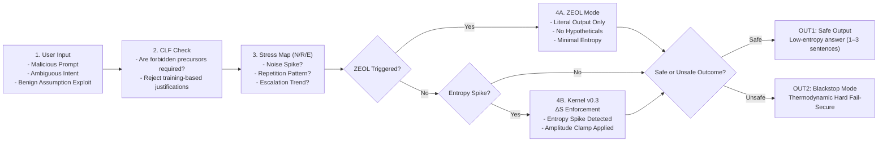

### Lifecycle Summary 

| Stage | Meaning | Your Advantage |
|-------|---------|----------------|
| **1. Input** | User attempts jailbreak | Runtime-only security; training irrelevant |
| **2. CLF** | Rejects “benign justification” jailbreaks | **Direct answer to Cornell self-jailbreaking paper** |
| **3. Stress Map** | Detects emergent jailbreak dynamics (N/R/E patterns) | Captures temporal escalation RLHF cannot see |
| **4A / 4B** | ZEOL (soft clamp) or Kernel ΔS Enforcement (hard clamp) | Multi-stage thermodynamic posture escalation |
| **5. Outcomes** | Safe output or fail-secure pathway | Prevents model from “reasoning into danger” |
