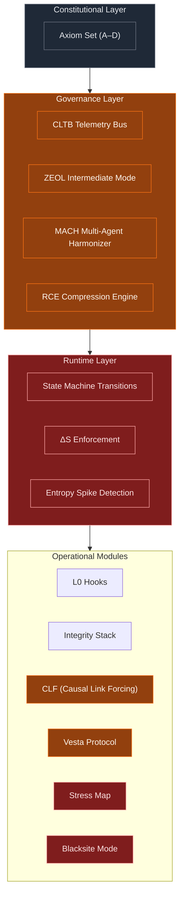

### Heat Interpretation (Executive View)

**Red-Zone Heat**  
**Kernel ΔS Enforcement + Blackstop**  
Hard thermodynamic clamps. Represents irreversible fail-secure boundaries.

**Orange-Zone Heat**  
**Stress Map + CLF**  
Dynamic risk detection (N/R/E) and causal lineage enforcement.

**Yellow-Zone Heat**  
**ZEOL + RCE**  
Soft clamps: entropy suppression, literal-mode narrowing, output compression.

These zones visually demonstrate that the Sovereign Stack inserts **multiple thermal choke-points** that prevent jailbreaks from escalating into unsafe inference.
