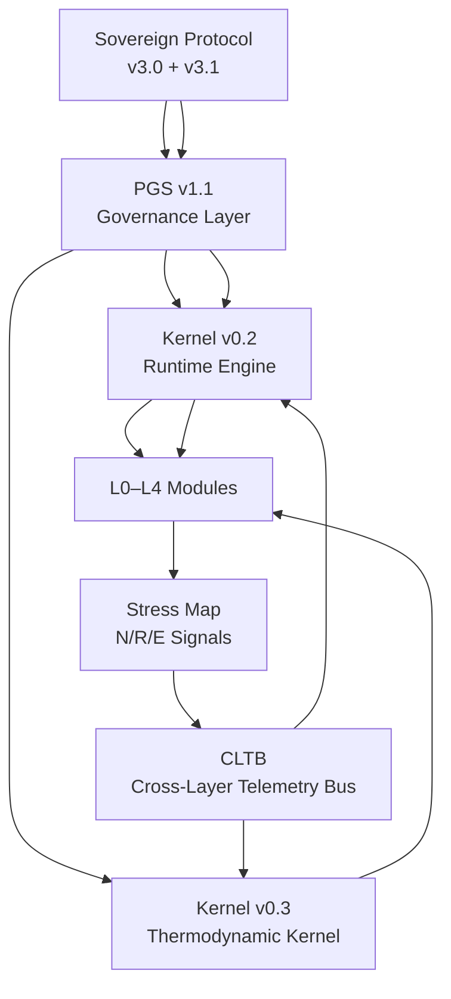

# Sovereign Stack — Data Flow Diagram  
Layered Telemetry & Constraint Movement

Narrative Explanation
Telemetry (bottom → up)

Modules generate operational telemetry (N/R/E, confidence, causality).

Stress Map consolidates signal pressure.

CLTB performs unified, read-only telemetry aggregation.

Kernel consumes CLTB to determine posture, entropy state, and mode transitions.

Constraints (top → down)

Sovereign Protocol defines constitutional physics.

PGS v1.1 generates governance constraints (ZEOL, RCE, MACH).

Kernel enforces deterministic or thermodynamic transitions.

Modules execute the constraints and update telemetry.

This creates a closed governance loop with no ambiguity or softness under load.

END OF DOCUMENT
