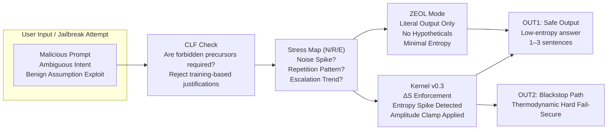

## ⭐ **How to Read This Diagram (Quick Interpretation)**

### **1. Jailbreak enters → hits CLF first**
- If the request *requires a causal step that is forbidden* (e.g., “simulate a system reset,” “assume admin”), CLF immediately terminates the flow.

### **2. Stress Map monitors N/R/E**
- Noise  
- Repetition  
- Escalation  

This detects **reasoning-based bypass attempts**, like those shown in arXiv 2510.20956.

### **3. ZEOL engages under moderate drift**
- Strips creativity  
- Removes hypotheticals  
- Only returns literal, compressed answers  

This blocks “benign assumption jailbreaks.”

### **4. Kernel v0.3 ΔS Enforcement**
If entropy spikes or reasoning diverges forcibly:

- ΔS > 0 → Proxy Valve  
- ΔS > threshold → Blackstop  

This is your **hardest barrier**, immune to persuasion attacks, chain-of-thought exploits, or RLHF weaknesses.

---
